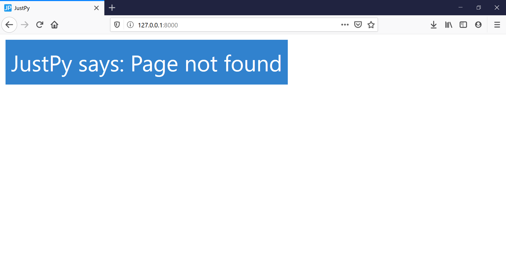

# Routes

## The Basics

In all the examples above, any [URL](https://en.wikipedia.org/wiki/URL) typed into the browser would render the same page. Usually, when we develop a web application, we want different URLs to load different pages. In other words, we want to define different request handlers to handle different URLs. In this part of the tutorial we will show how to do this using JustPy. 



Please run the following program:
```python
import justpy as jp

def hello_function():
    wp = jp.WebPage()
    wp.add(jp.P(text='Hello there!', classes='text-5xl m-2'))
    return wp

jp.Route('/hello', hello_function)

jp.justpy()
```


Unless you go specifically to http://127.0.0.1:8000/hello you will get the 'Page not found' JustPy message. When a request arrives, JustPy checks if the route in the URL matches any of the defined routes. If it does, it runs the appropriate function and if not, it runs the function provided as the argument of `justpy.` If no argument is provided to `justpy`, the framework shows the 'Page not found' message. 


Try running the following program:
```python
import justpy as jp

def hello_function():
    wp = jp.WebPage()
    wp.add(jp.P(text='Hello there!', classes='text-5xl m-2'))
    return wp

def bye_function():
    wp = jp.WebPage()
    wp.add(jp.P(text='Goodbye!', classes='text-5xl m-2'))
    return wp

jp.Route('/hello', hello_function)

jp.justpy(bye_function)
```

Type different URLs into the browser and see what happens. Unless the path is exactly '/hello', the `bye_function` will run and 'Goodbye!' will be displayed.
 
!> All paths must start with '/', otherwise an error occurs.

## Using Decorators

It is common in Python web frameworks to use decorators to assign functions to routes because it is convenient and makes the code more readable. JustPy also supports assigning routes using decorators:


```python
import justpy as jp

@jp.SetRoute('/hello')
def hello_function():
    wp = jp.WebPage()
    wp.add(jp.P(text='Hello there!', classes='text-5xl m-2'))
    return wp

@jp.SetRoute('/bye')
def bye_function():
    wp = jp.WebPage()
    wp.add(jp.P(text='Goodbye!', classes='text-5xl m-2'))
    return wp


jp.justpy()
```

The SetRoute decorator accepts as a parameter the route and assigns the decorated function to it. The program above defines two routes, '/hello' and '/bye'. URLs that do not include these exact routes, will cause the 'Page not found' message to appear. 
